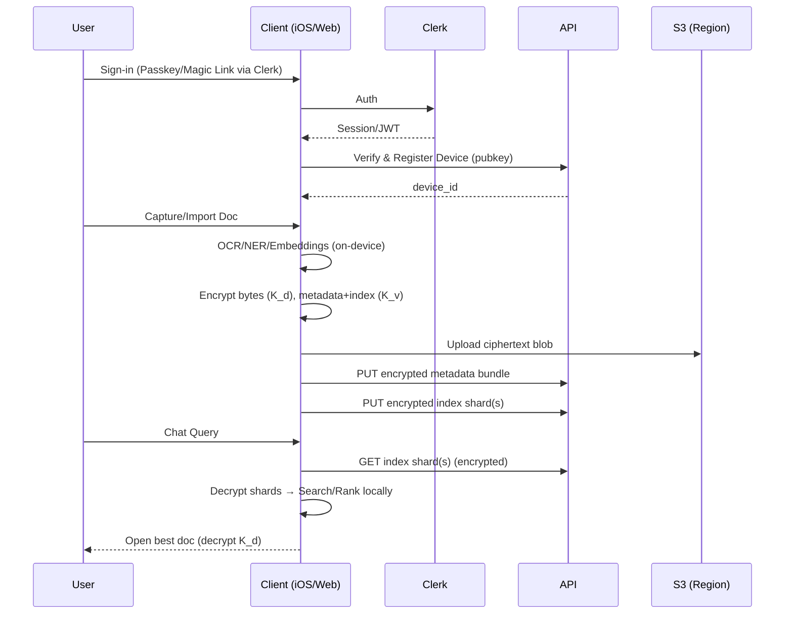

## Arqivo — Cloud‑First Architecture and v0 Plan

Last updated: 2025‑09‑05

### North Star
- **Upload once, recall forever**: years later, ask “show my MacBook Air receipt I bought four years ago,” and the chat finds and opens it instantly.
- **Cloud‑first, zero‑knowledge**: everything is encrypted on device; server stores ciphertext only.

### Scope and Non‑Goals (v0)
- **In scope**: iOS app + Web app (PWA), Clerk auth, device registration, per‑doc encryption, vault key, encrypted uploads (blobs + metadata + index shards), chat recall with semantic search, recovery phrase, region readiness (default `us`).
- **Out of v0**: Android app (v1), family vaults (v1.1), mail importer (v1.2), Trusted Compute accelerator (v1.1), reminders/wake‑tokens (v1), advanced exports (v1.2).

---

## System Overview

### Components
- **Clients**
  - iOS app (SwiftUI): capture/import, on‑device OCR/NER, embeddings, encryption, upload, chat UI.
  - Web app (Next.js PWA): Clerk auth, upload (drag‑drop), WASM OCR fallback, embeddings, encryption, chat UI.
- **Server (ciphertext‑only)**
  - REST API: auth verification (Clerk), devices, blobs, metadata, index shards, quota, region routing.
  - Storage: S3 buckets per region (`us`, prepared for `eu`), content‑addressed keys with size padding.
  - Postgres: accounts (maps `clerk_user_id → account_id`), devices, quotas, region code, billing flags.

### High‑Level Invariants
- No plaintext content or metadata leaves the device.
- Server only sees: ciphertext blobs, encrypted metadata bundles, encrypted index shards, anonymous IDs, quotas, region code.
- Search runs client‑side on decrypted index shards.

### Key Flows (E2E)



---

## Security & Cryptography

### Keys and Wrapping
- **Per‑document key `K_d`**: 32‑byte, AES‑256‑GCM. Random 96‑bit nonce per fragment.
- **Vault key `K_v`**: 32‑byte master for the vault; encrypts:
  - Document keys `K_d`
  - Encrypted metadata bundles
  - Encrypted index shards
- **Device keypair**: X25519 (key exchange) + Ed25519 (signatures), generated on device. `K_v` is wrapped to each device via X25519 ECDH derived key.
- **Recovery**: 12‑word phrase (BIP‑39 EN wordlist) → Argon2id KDF → wraps `K_v`; stored as an encrypted recovery blob server‑side.

### Algorithms & Libs
- Symmetric: AES‑256‑GCM; per‑chunk nonces derived via HKDF(`K_d`, chunk_index) if chunking.
- Asymmetric: X25519 (ECDH), Ed25519 (signatures).
- KDF: Argon2id, device‑class tuned (e.g., memory 64–256MB, time cost 3–6, parallelism = 2–4).
- RNG: OS CSPRNG only.
- Libraries: libsodium (Swift bindings on iOS, WASM `libsodium-wrappers-sumo` on Web) + WebCrypto for AES‑GCM where appropriate.

### Envelope Formats
- **Encrypted document bytes**: optional chunking (1–4MB). Each chunk: AES‑GCM(ciphertext, nonce, aad: version+doc_id+chunk_index).
- **Encrypted metadata bundle**: CBOR payload `{schema_version, type, entities[], dates, amounts, tags[], confidence}` encrypted with `K_v`.
- **Encrypted index shard**: CBOR payload `{schema_version, shard_id, vectors[], ids[], norms?, quantization}` encrypted with `K_v`.

### Threat Model (abridged)
- Server compromise yields ciphertext only; no keys stored server‑side.
- Clerk breach yields identity, not content; device keys and `K_v` remain client‑only.
- Device loss recoverable via 12‑word phrase (+ optional TOTP). Without recovery, data is irretrievable by design.

---

## Data & Storage

### Server‑Side Data (Ciphertext‑Only)
- Blobs: `r/{region}/{account_id}/blobs/{doc_id}` → ciphertext bytes.
- Metadata: `r/{region}/{account_id}/meta/{doc_id}` → encrypted metadata bundle.
- Index: `r/{region}/{account_id}/index/{shard_id}` → encrypted index shards.
- Size padding: store real size internally, expose padded buckets for billing (e.g., 128KB, 256KB, 512KB, 1MB, 2MB, 4MB, 8MB, 16MB, 32MB, 64MB, 128MB).
- Database (Postgres): `accounts(account_id, clerk_user_id, region_code, plan)`, `devices(device_id, account_id, pubkey, created_at)`, `quota(account_id, byte_count, doc_count)`.

### Region Readiness (v0 implemented, v1 activated)
- Account carries `region_code` (default `us` in v0 UI).
- Storage keys prefixed by region starting now.
- API layer aware of region → dispatches to per‑region S3 client/bucket.
- Future: regional front doors `api.us.arqivo.com`, `api.eu.arqivo.com`, and per‑region CDNs for ciphertext.

---

## Client Processing & Search

### OCR/NER/Embeddings
- iOS: Apple Vision OCR; Core ML for NER/classification; int8 sentence embeddings.
- Web: WASM Tesseract fallback for OCR; small on‑device models via WebAssembly/WebGPU.

### Indexing Strategy
- v0: **brute‑force cosine similarity** over up to ~2k vectors for simplicity and reliability (<1.5s median on mid‑tier devices). Quantize to int8 to cut memory.
- v1: HNSW on device (SQLite‑vec or WASM HNSWlib) for 10k+ docs.

### Recall Flow (Chat)
1. Parse query: extract entities (e.g., “MacBook Air”), time hints (“four years ago”), doc type (“receipt”).
2. Compute query embedding on device.
3. Fetch needed encrypted index shards; decrypt with `K_v`.
4. Score candidates (semantic + keyword + field match boosts). Apply filters (type/date/entity).
5. Decrypt top result’s `K_d` and display original doc with highlighted fields.

---

## API Surface (Server, ciphertext‑only)

```
POST   /v1/auth/verify           → Verify Clerk session/JWT
POST   /v1/devices/register      → Upload device public key; returns device_id
PUT    /v1/blobs/{id}            → Upload encrypted blob (ciphertext only)
GET    /v1/blobs/{id}            → Download encrypted blob
PUT    /v1/metadata/{doc_id}     → Upload encrypted metadata bundle
GET    /v1/metadata/{doc_id}     → Download encrypted metadata bundle
PUT    /v1/index/{shard_id}      → Upload encrypted index shard
GET    /v1/index/{shard_id}      → Download encrypted index shard
GET    /v1/quota                 → Usage counters (no content)
```

Notes:
- Clerk is the identity provider; we map `clerk_user_id` to `account_id`.
- No plaintext metadata accepted; server validates size bounds, content‑type, integrity hashes of ciphertext.

---

## UX and Product

### Capture / Import
- One‑tap capture with auto‑save; `Undo` snackbar.
- Auto‑crop, de‑skew, glare reduction.
- Multi‑page PDFs; page thumbnails.

### Chat Recall
- Natural language first; quick filters (type/date/entity) always visible.
- Top result preview with extracted fields; open full doc with actions (export, share to app).

### Recovery & Devices
- 12‑word recovery phrase setup; strongly worded warnings.
- Add device via QR: ephemeral X25519 handshake to rewrap `K_v`.

---

## Compliance & Telemetry (v0 stance)
- Opt‑in telemetry only; coarse counters, no identifiers.
- No content logs; request IDs and timings only with short TTL.
- Data deletion: purge ciphertext and keys immediately on delete request (with grace period configurable later).

---

## v0 Implementation Plan (iOS + Web first)

### Milestone A — Foundations (Week 1)
- Create monorepo structure (`apps/ios`, `apps/web`, `services/api`, `packages/crypto`, `packages/shared`).
- Provision S3 bucket(s) for `us` and placeholder for `eu`; enable server‑side encryption (redundant with E2EE) and versioning.
- Set up Postgres schema for accounts/devices/quotas (with `region_code`).
- Integrate Clerk on Web and API; verify JWT; map `clerk_user_id → account_id`.

Acceptance:
- Web sign‑in works via Clerk; server verifies tokens; region code stored on account.

### Milestone B — Client Crypto & Recovery (Week 1–2)
- Implement `packages/crypto` with libsodium: keygen, AES‑GCM, HKDF, Argon2id, CBOR envelopes.
- Implement recovery phrase (BIP‑39) and Argon2id wrapping of `K_v`; store encrypted recovery blob via API.
- Device registration: generate X25519/Ed25519, upload public key; server returns `device_id`.

Acceptance:
- Deterministic encrypt‑before‑upload tests pass with fixtures on both iOS and Web.
- Recovery round‑trip validates rewrapping `K_v` on a fresh device.

### Milestone C — Storage & API (Week 2)
- Implement REST endpoints for blobs, metadata, index shards, quota.
- Storage service routes by account `region_code` (prefix keys with `r/{region}/…`).
- Content addressing by hash(ciphertext) for blobs; no cross‑user dedup.

Acceptance:
- PUT/GET of ciphertext objects succeeds with integrity checks and quota updates.

### Milestone D — iOS Capture → Upload (Week 2–3)
- Camera with auto‑crop/de‑skew; Vision OCR; Core ML NER/classify.
- Build embeddings; encrypt bytes/metadata/index; upload; update local cache.

Acceptance:
- Single‑page receipt captured → appears in recent uploads list in Web within seconds.

### Milestone E — Web Upload & Chat (Week 3–4)
- Drag‑drop upload; WASM OCR fallback for images/PDFs; embeddings; encrypt; upload.
- Chat UI: query → embedding → fetch+decrypt shards → brute‑force cosine → rank → open doc.

Acceptance:
- Query “my MacBook Air receipt” returns correct doc top‑1 across ~2k docs in <1.5s median.

### Milestone F — Hardening & UX Polish (Week 4–6)
- Offline queueing for uploads and search on cached shards.
- Size padding buckets; error handling; retries; timeouts; low‑battery throttling.
- Recovery UX; device link via QR; basic export (local only).

Acceptance:
- Kill network: capture queues and later uploads; cached search still works.
- Fresh device recovery restores access using 12‑word phrase.

---

## Open Decisions (defaults proposed)
- Auth providers via Clerk: enable Email, Apple, Google (default set).
- Regions: `us` default in v0; `eu` selectable in v1; prefix keys now.
- Embedding model: 384‑D int8 MiniLM‑class; v0 brute‑force search; v1 HNSW.
- Argon2id parameters: start at mem=128MB, time=4, parallel=2; tune by device.

---

## Acceptance Criteria (v0)
- Encrypt‑before‑upload proven on device with fixtures; no server plaintext.
- iOS + Web upload and recall flow operational end‑to‑end.
- Chat query over 2k docs returns correct top‑1 in <1.5s median on mid‑tier device.
- Region prefixes present in storage keys; account stores `region_code`.
- Recovery with 12‑word phrase restores `K_v` on a new device.

---

## Appendix: Data Schemas (Client‑Side, pre‑encryption)

```
Document
  id: uuid
  bytes: binary
  derived:
    type: enum(receipt, id, warranty, contract, medical, other)
    entities: [string]
    dates: { captured_at, doc_date, expiry_date? }
    amounts: { total?, currency? }
    confidence: float 0..1
    tags: [string]
  crypto:
    K_d: 32‑byte
    cipher_text: bytes
    mac: bytes

Vault
  id: uuid
  K_v: 32‑byte (never leaves device unwrapped)
  devices: [device_id]

Device
  id: uuid
  public_key: bytes
  wrapped_K_v: bytes
```


